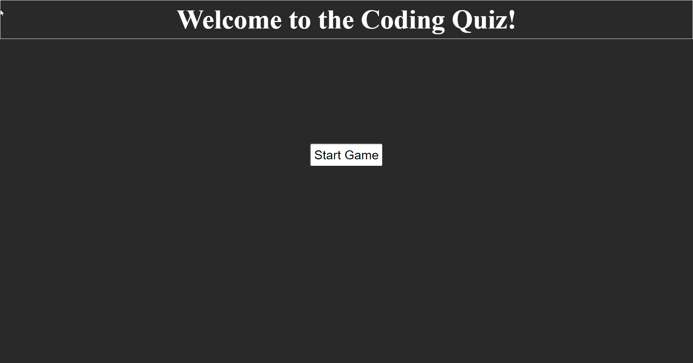

# Homework Week 4 Coding Quiz Michael Ariti

## Coding Quiz

The purpose of this repository is to create a small multiple choice javascript game based on some questions about javascript.

## Features

1. 10 Questions that are picked randomly and do not repeat.
2. A Timer that counts down from 150 seconds.
3. The ability to save your highscore.
4. Responsive buttons, including a replay and a reset button.

## File Directory

You will find the index.html next to this readme, which is the finished website code.

In the assets folder you will find 
1. The guidelines to this homework
2. The css style sheet for the index.html
3. The screenshot of the finished website which is pictured below.
4. The javascript used to run the generator.

## Bugs
There are several bugs unfortunately that I have found listed below
1. On page reload Countdown will go down at twice the speed, on second reload 3 times the speed.
2. h4's get printed on the 3rd refresh onwards.
3. local storage is wiped on page refresh. 

## Secreenshot

## Webpage URL
[Coding-Quiz-URL](https://michaelfellas.github.io/Coding-Quiz/)

### End

Michael Ariti 2021
